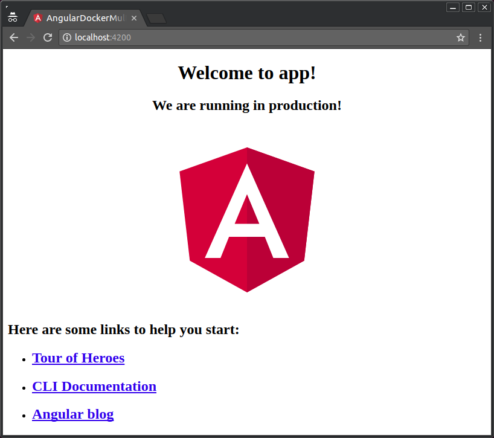
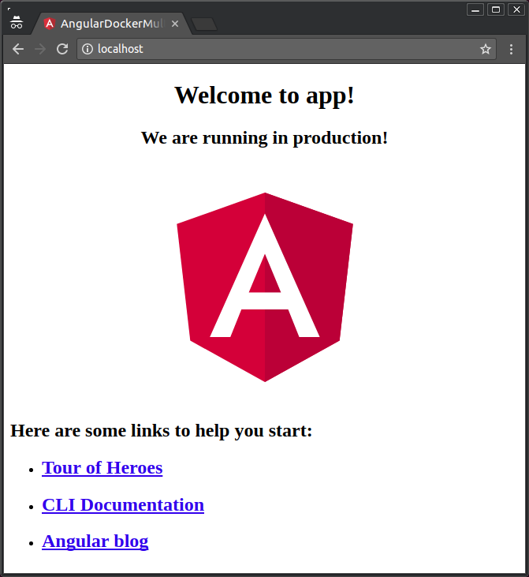
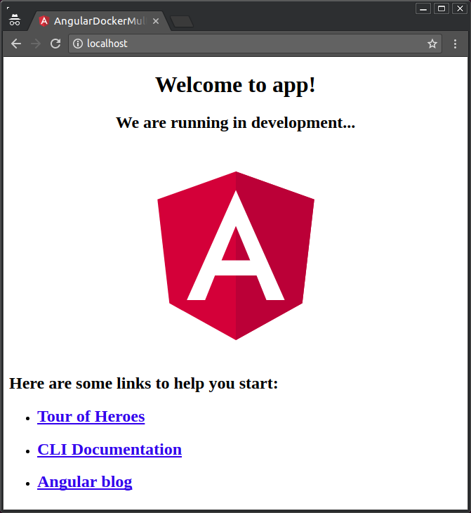

# Angular in Docker with Nginx, supporting configurations / environments, built with multi-stage Docker builds and testing with Chrome Headless

**Note**: Updated on 2018-06-25, to match Angular 6 and Angular CLI 6. Updating parameters, configuration files, and versions of Node.js and Nginx. And a new section with testing using Pupeteer and Chrome headless inside Docker.

...that's a very long title. But that's what I'm covering, so let's dive in!

Here's how to deploy an [Angular](https://angular.io/) app with [Docker](https://www.docker.com/), building it with [Node.js](https://nodejs.org) as you would do locally, but end up with a thin and efficient [Nginx](https://nginx.org/) image, with just the compiled code. Ready for production.

To achieve that, you can use [Docker "multi-stage builds"](https://docs.docker.com/engine/userguide/eng-image/multistage-build/). That will allow you to first build your Angular app inside a (possibly huge) Node JS Docker container that is later discarded in favor of a thin Nginx image with just your compiled app. And your final image will be as thin as the latest layer (Nginx).

Here you will also see how to use that technique but still support [Angular CLI](https://github.com/angular/angular-cli) [environments / configurations](https://github.com/angular/angular-cli/wiki/stories-application-environments).

All this removes the need for complex building scripts or the need to add your built app to git (your `dist` directory).

Also, optionally, you can run your Karma tests in Chrome Headless inside the Docker container. All the information is in the last section.

This could also be adapted to any compiled front end framework like [React](https://reactjs.org/). But the main tricks you need are all below.

## TL;DR:

* Create a new Angular project, e.g. "my-angular-project":

```bash
ng new my-angular-project
```

* Enter into your project directory:

```bash
cd my-angular-project
```

* While developing, use `ng serve` as you normally would, to be able to use live-reload and other features. But for production deployment with Docker, and to test the "production deployment" locally, do the following.
* Add a Nginx configuration inside your project directory, named `nginx-custom.conf`, with:

```nginx
server {
  listen 80;
  location / {
    root /usr/share/nginx/html;
    index index.html index.htm;
    try_files $uri $uri/ /index.html =404;
  }
}
```

* Add a `.dockerignore` for `node_modules` with:

```
node_modules
```

* Add a `Dockerfile` in your directory with:

```Dockerfile
# Stage 0, "build-stage", based on Node.js, to build and compile Angular
FROM node:10.5 as build-stage

WORKDIR /app

COPY package*.json /app/

RUN npm install

COPY ./ /app/

ARG configuration=production

RUN npm run build -- --output-path=./dist/out --configuration $configuration


# Stage 1, based on Nginx, to have only the compiled app, ready for production with Nginx
FROM nginx:1.15

COPY --from=build-stage /app/dist/out/ /usr/share/nginx/html

COPY ./nginx-custom.conf /etc/nginx/conf.d/default.conf
```

* Build your image using the production configuration (the default), e.g.:

```bash
docker build -t my-angular-project:prod .
```

* Build your image using the development environment (no configuration), e.g.:

```bash
docker build -t my-angular-project:dev --build-arg configuration="" .
```

* Test your image for the production environment (production configuration) with:

```bash
docker run -p 80:80 my-angular-project:prod
```

* Open your browser in <http://localhost>.
* Test your image for the development environment (no configuration) with:

```bash
docker run -p 80:80 my-angular-project:dev
```

* Open your browser in <http://localhost>.
* If you are using testing and want to integrate it, read the last section.

## Details

*Everything above shows the actual code you need. If you're in a hurry, you could probably just copy all that. If you want to know all the details, continue reading...*

---

When you build an Angular front-end app, you most commonly write it in [TypeScript](http://www.typescriptlang.org/) and then compile it to JavaScript. But you need to have Node.js and several packages to do that.

After you compile your app, you end up with a set of files, normally in a directory with the name of your app inside a  `./dist` directory. Those are the compiled files that you actually use to serve your app. And those files have all the optimizations that you use, for example, AOT (Ahead Of Time compilation).

And those files are the final product that you serve to your users. Your users don't need your source TypeScript files nor any of the packages you use during development, just the compiled files.

So, you need to "deploy to production" only those files.

These are the options we have, take them as the "motivation" for what we will do next:

### Option 1:

One way to do it is to compile the app locally and add the compiled files to your Git repository. And then, when you are deploying, you just clone your repository and use those compiled files. As we are talking about Docker, you would create an image that copies and uses those compiled files. Your would probably use an [Nginx base image](https://hub.docker.com/_/nginx/) for that.

But you never edit those compiled files directly, they are generated from your source files. They are constantly changing, so your Git repository will grow large just because you are adding compiled code. And if someone in your team works on a feature branch and has one version of those files and he wants to merge the feature to your main branch (probably `master`), you might have lots conflicts in those files, even when the source code doesn't have conflicts. So you would have to be fixing "virtual" conflicts. There are probably other disadvantages too. So, the compiled files don't really belong in your Git repository.

Also, if you forget to compile and commit everything right before deploying, you'll get an old version of the deployed app.


### Option 2:

Another way to do it would be to do not add your compiled code to your Git repository and build your app every time you are going to deploy.

But this would require all your deployment servers or wherever it is that you build your Docker image to have all the tooling to deploy your app. Node.js, TypeScript, all the Angular packages, all the dependencies, etc.

And again, if you forget to compile everything right before deploying, you'll get an old version of the app deployed.

But all the problems that you would have with dependencies by needing to have all the tooling in a server is what Docker is supposed to solve, right?


### Option 3:

You could build the whole app inside your Docker image, and then serve it from the same image.

That would imply that you would start from an [official Node.js base image](https://hub.docker.com/_/node/) to compile everything and then you would have to setup a server with Node.js or install Nginx manually on top of Node.js (or something similar).

If you install Nginx by hand you lose the option to use the [official Nginx base image](https://hub.docker.com/_/nginx/) that is already fine tuned.

Also, you would end up with huge images that all your deployment servers have to download (if you are concerned about size) and a complex environment, with all the Node.js / Angular packages and dependencies.


### Option 4:

You could write a complex script that builds your app in one Docker image using Node.js, then extract the compiled files, and then build a second image based on Nginx with just your compiled files.

We are getting close, but you would have another complex script to debug. Copying files from a Docker container and to another Docker image, etc. Not that promising...


### Option 5:

Use [Docker multi-stage builds](https://docs.docker.com/engine/userguide/eng-image/multistage-build/). With that, you can have a Node.js base image that installs, builds and compiles everything, and then, "discard" all those Node.js specific Docker image layers, and end up with a Nginx image with just your compiled code.

You would have an efficient Nginx server with great performance for your static final (compiled) files. You wouldn't have to add your compiled code to Git, you always get the latest compiled version of your code, you don't have to deal with dependencies outside Docker, etc.

That's great! Docker multi-stage builds solve several problems in one shot. And this option is what is [described in this article: "Create efficient Angular Docker images with Multi Stage Builds"](https://medium.com/@avatsaev/create-efficient-angular-docker-images-with-multi-stage-builds-907e2be3008d). But...

When building your Angular code with [Angular CLI](https://github.com/angular/angular-cli) you have the option to use ["configurations" to set the `environment`](https://github.com/angular/angular-cli/wiki/stories-application-environments) while building the Angular app. That alows you to, for example, use a production back end API while using the "`production`" environment / configuration and use a testing back end API while using the unmodified configuration (development environment).

But with just the method described above we would have no way to use that feature.

---

So, let's create an **Option 6** that combines all of the above and lets us use Angular CLI configurations / environments.


## Requirements

* [Angular CLI](https://github.com/angular/angular-cli) (you need to have [Node.js](https://nodejs.org) first)
* [Docker](https://www.docker.com/)

## Angular

If you don't know Angular (Angular 2+) yet, go and do [their tutorials](https://angular.io/docs) first.

If you are building an Angular front-end web app, you probably should create your code with [Angular CLI](https://github.com/angular/angular-cli).

That will help you setting everything up, compiling the app with AOT (Ahead Of Time compilation), serving the app during development with automatic live-reload, etc.

* So, go ahead and install [Angular CLI](https://github.com/angular/angular-cli).
* To create a new Angular project, e.g. "my-angular-project", run:

```bash
ng new my-angular-project
```

* Enter into your project directory:

```bash
cd my-angular-project
```

* To be able to see the differences between the Angular CLI environments in the final app, edit your component code in `src/app/app.component.ts`, import the `environment`:


```TypeScript
import { environment } from '../environments/environment';

...
```

* Then, add that environment's `production` property as a component property, so that you can use it in your template:

```TypeScript
...

export class AppComponent {
  
...

  production = environment.production;
}
```

* Your final code might look like:

```TypeScript
import { Component } from '@angular/core';

import { environment } from '../environments/environment';

@Component({
  selector: 'app-root',
  templateUrl: './app.component.html',
  styleUrls: ['./app.component.css']
})
export class AppComponent {
  title = 'app';

  production = environment.production;
}
```

* Then, edit your template to show your `production` value, for example, add the following:

```html
...

<h2 *ngIf="production">We are running in production!</h2>
<h2 *ngIf="!production">We are running in development...</h2>

...
```

* Your final template might look like:

```html
<div style="text-align:center">
  <h1>
Welcome to {{title}}!
  </h1>
  <h2 *ngIf="production">We are running in production!</h2>
  <h2 *ngIf="!production">We are running in development...</h2>
</div>
```

**Note**: I'm omitting some of the default Angular CLI code for brevity.

* Now, if you run your code locally with the defaults, e.g.:

```bash
ng serve
```

* And open your browser in <http://localhost:4200>

...you will see your code using the default development environment (no configuration). So you might probably see something like:


* But if you run it passing the `--prod` flag (or the more specific `--configuration=production`), e.g.:

```bash
ng serve --prod
```

* And open your browser in <http://localhost:4200>

...you will probably see something like:



*notice the "`running in production!`"*.

* To learn more about Angular CLI environments and configurations, check [the official Angular CLI documentation](https://github.com/angular/angular-cli/wiki/stories-application-environments).

This is a bare-bones Angular project. Just the basic parts to show the point. There are many ways to improve Angular using modules, etc. But we'll just stick to the basics for now.


## Nginx

Nowadays, Nginx is more or less the "de facto standard" for static content serving. You can search about it and read about its performance. The web is full of articles about it.

So, for our final Docker image, we will need to have a Nginx configuration. You don't really need to know much more about it for now. As the official Docker image will do all the heavy lifting for you.

But we do need to create a basic config file that we'll use later.

* Add a Nginx configuration inside your project directory, named `nginx-custom.conf`, with:

```nginx
server {
  listen 80;
  location / {
    root /usr/share/nginx/html;
    index index.html index.htm;
    try_files $uri $uri/ /index.html =404;
  }
}
```

* The most important part is the:

```nginx
try_files $uri $uri/ /index.html =404;
```

...that tells Nginx to try to match the files it is requested in the URL (URI) with files it has available. That will make it, for example, match the `/main.bundle.js` and return the JavaScript file. But when there's no match, it will default to `index.html`.

That will make it return the `index.html` for any other URL it receives, so, all the Angular router URLs will work, even when going to the URL directly in the browser (not being redirected from an internal section of the app).

Without that, if you had a route like `/app/dashbaord/main`, when you tried to open that URL, Nginx wouldn't find the file `app/dashboard/main` and would return a `404 Not found`, instead of returning the `index.html` and letting the Angular router handle it.

The last part, `=404` tells Nginx to return a `404` if it doesn't even find an `index.html` file. That's the default case. But you will normally always have an `index.html` file.

Save that file, we will use it soon.

This is the minimum Nginx configuration. You could finetune it more, depending on your case. If you want to explore more, read the [Nginx Beginner's Guide](http://nginx.org/en/docs/beginners_guide.html#conf_structure).


## Docker

If you don't know Docker yet, and you do at least some back-end stuff (deploying a front-end app counts), it might change your developer life. So, go ahead, [install Docker](https://docs.docker.com/engine/installation/) and follow the [Get Started guide](https://docs.docker.com/get-started/).

Now, let's assume you already know enough Docker to use it. Let's go to our details.

Here, we'll see how we can use Docker multi-stage builds [Docker build-time `ARG`s](https://docs.docker.com/engine/reference/builder/#arg). That will allow us to pass build-time variables during image creation. And with that, we'll be able to build different images for the different Angular CLI environments, by just passing an argument to `docker`. But we need to do a couple things first.

When you build your image, Docker normally "sends" all the files in the directory to the component of Docker that builds the image. If you have a `node_modules` directory, it will take some time sending that as `node_modules` directories tend to be huge and with lots of files. But you don't need `node_modules` to be copied to your Docker image, you will install everything inside and create a `node_modules` inside your container, so, sending all your `node_modules` is a waste of time.

The same way that you would add `node_modules` to your `.gitignore` file, you can use a `.dockerignore` file.

* Add a `.dockerignore` for `node_modules` with:

```
node_modules
```

Now, let's build our Docker image.

* Add a file named specifically `Dockerfile` in your directory, with:

```Dockerfile
# Stage 0, "build-stage", based on Node.js, to build and compile Angular
FROM node:10.5 as build-stage

WORKDIR /app

COPY package*.json /app/

RUN npm install

COPY ./ /app/

ARG configuration=production

RUN npm run build -- --output-path=./dist/out --configuration $configuration


# Stage 1, based on Nginx, to have only the compiled app, ready for production with Nginx
FROM nginx:1.15

COPY --from=build-stage /app/dist/out/ /usr/share/nginx/html

COPY ./nginx-custom.conf /etc/nginx/conf.d/default.conf
```

...now, let's check what all that is doing.

* This will tell Docker that we will start with a base [Node.js official image](https://hub.docker.com/_/node/), notice that you won't have to install and configure Node.js inside the Linux container or anything, Docker does that for you:

```Dockerfile
FROM node:10.5 as build-stage
```

...we also "named" this stage `build-stage`, with the `as build-stage`. We will use this name later.

* Our working directory will be `/app`. This Docker "instruction" will create that directory and go inside of it, all the next steps will "be" in that directory:

```Dockerfile
WORKDIR /app
```

* Now, this instruction copies all the files that start with `package` and end with `.json` from your source to inside the container. With the `package*.json` it will include the `package.json` file and also the `package-lock.json` if you have one, but it won't fail if you don't have it. Just that file (or those 2 files), before the rest of the source code, because we want to install everything the first time, but not everytime we change our source code. The next time we change our code and build the image, Docker will use the cached "layers" with everything installed (because the `package.json` hasn't changed) and will only compile our source code:

```Dockerfile
COPY package*.json /app/
```

* Install all the dependencies, this will be cached until we change the `package.json` file (changing our dependencies). So it won't take very long installing everything every time we iterate in our source code and try to test (or deploy) the production Docker image, just the first time and when we update the dependencies (installed packages):

```Dockerfile
RUN npm install
```

* Now, after installing all the dependencies, we can copy our source code. This section will not be cached that much, because we'll be changing our source code constantly, but we already took advantage of Docker caching for all the package install steps in the commands above. So, let's copy our source code:

```Dockerfile
COPY ./ /app/
```

* And here's the trick that will allow us to use Angular CLI "configurations" and enable different environments. We create an `ARG` that we will pass at **build** time with a default value of `production` (the default value for Angular CLI). This will be done at "build time", while building the image, in contrast to at "run time", which is while "running" or starting the image. 

```Dockerfile
ARG configuration=production
```

* Inside our container we don't have a global Angular CLI installation, so we cannot just use `ng build`, because it won't find `ng`. But as Angular CLI creates an NPM script that builds everything, we can just use it, with `npm run build`. But we need to pass parameters to `ng` and we cannot pass them directly because `npm` would try to interpret them. So first we add `--` to let `npm` know that the next parameters are not for him, but for `ng`. Then, we pass the `--prod` parameter, the equivalent of `--configuration=production`, that [sets several things at once](https://github.com/angular/angular-cli/wiki/stories-application-environments). That will take care of optimizing everything for production. And lastly, we pass the `--configuration $configuration` parameter. See that we are using the "configuration variable" `$configuration` that we created right above. This environment variable won't persist after building (as an environment variable), but we can use it to pass parameters to Docker at "build time".

```Dockerfile
RUN npm run build -- --output-path=./dist/out --configuration $configuration
```

...that will build our app, to the directory `./dist/out`. Inside the container will be in `/app/dist/out`. We are specifying the specific `--output-path=./dist/out` because otherwise by default Angular CLI would use the name of the project, for example `./dist/my-angular-project`. But we need to have a specific path to use it later. So, by fixing it to `./dist/out` you can copy-paste it directly to your project without worrying about modifying paths in several places.

* In the same file, we start another section (another "stage"), like if 2 `Dockerfile`s were concatenated. That's Docker multi-stage building. It almost just looks like concatenating `Dockerfile`s. So, let's start with an [official Nginx base image](https://hub.docker.com/_/nginx/) for this "stage":

```Dockerfile
FROM nginx:1.15
```

...if you were very concerned about disk space (and you didn't have any other image that probably shares the same base layers), or if, for some reason, you are a fan of Alpine Linux, you could change that line and use an [Alpine version](https://hub.docker.com/_/nginx/).

* Here's the Docker multi-stage trick. This is a normal `COPY`, but it has a `--from=build-stage`. That `build-stage` refers to the name we specified above in the `as build-stage`. Here, although we are in a Nginx image, starting from scratch, we can copy files from a previous stage. So, we can copy the compiled fresh version of our app. That compiled version is based on the latest source code, and that latest compiled version only lives in the previous Docker "stage", for now. But we'll copy it to the Nginx directory, just as static files:

```Dockerfile
COPY --from=build-stage /app/dist/out/ /usr/share/nginx/html
```

* Now, we'll override the `default.conf` file in Nginx with our custom `nginx-custom.conf` file that lets Angular router take care of it's routes:

```Dockerfile
COPY ./nginx-custom.conf /etc/nginx/conf.d/default.conf
```

...that's it for the `Dockerfile`! Doing that with scripts or any other method would be a lot more cumbersome.

## Build it

Now we can build our image, that will compile everything and create a Nginx image ready for serving our app.

If we just build it normally, it will use the production configuration (`production`) and environment.

* Build your image using the production configuration / environment (the default), e.g.:

```bash
docker build -t my-angular-project:prod .
```

But we can build an image for each environment we have, by just passing the configuration name as an argument to the build process. The same as we would pass it to `ng build --configuration`. We just have to use Docker's `--build-arg` parameter.

* Build your image passing an empty string as the `configuration` build arg, so that Angular CLI doesn't use a configuration and runs with the development environment, e.g.:

```bash
docker build -t my-angular-project:dev --build-arg configuration="" .
```

* If you had a `staging` configuration and environment, you could build an image for that environment with:

```bash
docker build -t my-angular-project:dev --build-arg configuration="staging" .
```

## Test it

To check that your new Docker images are working, you can start a container based on them and see the results.

* Test your image for the production environment with:

```bash
docker run -p 80:80 my-angular-project:prod
```

...you won't see any logs, just your terminal hanging there.

* Open your browser in <http://localhost>.

You should see something very similar to:



...notice that it is served by Docker and not by Angular CLI (not in port `4200`). And notice that it says that you are running the "production" version of your front end App.

* Test your image for the development environment with:

```bash
docker run -p 80:80 my-angular-project:dev
```

* Open your browser in <http://localhost>.

You should see something very similar to:



...again, served by Docker and not by Angular CLI (not in port `4200`). And now you are using your "development" environment version.

## Add testing

If you are using testing with [Jasmine](https://jasmine.github.io/) and [Karma](https://karma-runner.github.io/), you can run your tests using Chrome headless and integrate that in your `Dockerfile`.

That will allow it to run in a Docker container, and you will be able to test your application before building it and integrate it with CI systems (e.g. GitLab CI).

First, you need to add [Puppeteer](https://github.com/GoogleChrome/puppeteer) as a dependency following [Karma’s official documentation](https://github.com/karma-runner/karma-chrome-launcher#headless-chromium-with-puppeteer):

* Go to your application directory and install Puppeteer:

```bash
npm install puppeteer --save-dev
```

* Then install `karma-chrome-launcher`:

```bash
npm install karma-chrome-launcher --save-dev
```

* Modify your `src/karma.conf.js` file, add this on the top:

```JavaScript
process.env.CHROME_BIN = require('puppeteer').executablePath()
```

* Modify your `src/karma.conf.js` file, there's a line with:

```JavaScript
    browsers: ['Chrome'],
```

replace that line with:

```JavaScript
    browsers: ['Chrome', 'ChromeHeadlessNoSandbox'],
    customLaunchers: {
      ChromeHeadlessNoSandbox: {
        base: 'ChromeHeadless',
        flags: [
          '--no-sandbox',
          // Without a remote debugging port, Google Chrome exits immediately.
          '--remote-debugging-port=9222',
        ]
      }
    },
```

your final `src/karma.conf.js` might look like:

```JavaScript
// Karma configuration file, see link for more information
// https://karma-runner.github.io/1.0/config/configuration-file.html

module.exports = function (config) {
  config.set({
    basePath: '',
    frameworks: ['jasmine', '@angular-devkit/build-angular'],
    plugins: [
      require('karma-jasmine'),
      require('karma-chrome-launcher'),
      require('karma-jasmine-html-reporter'),
      require('karma-coverage-istanbul-reporter'),
      require('@angular-devkit/build-angular/plugins/karma')
    ],
    client: {
      clearContext: false // leave Jasmine Spec Runner output visible in browser
    },
    coverageIstanbulReporter: {
      dir: require('path').join(__dirname, '../coverage'),
      reports: ['html', 'lcovonly'],
      fixWebpackSourcePaths: true
    },
    reporters: ['progress', 'kjhtml'],
    port: 9876,
    colors: true,
    logLevel: config.LOG_INFO,
    autoWatch: true,
    browsers: ['Chrome', 'ChromeHeadlessNoSandbox'],
    customLaunchers: {
      ChromeHeadlessNoSandbox: {
        base: 'ChromeHeadless',
        flags: [
          '--no-sandbox',
          // Without a remote debugging port, Google Chrome exits immediately.
          '--remote-debugging-port=9222',
        ]
      }
    },
    singleRun: false
  });
};
```

* Normally you would test your app with:

```bash
ng test
```

You can try and run that. It will run the tests in your local browser. And that's how you should test it during development.

* But in a Docker container in your "integration" or "production" server, it will run in Chrome headless. So, let's first make sure that Chrome headless runs locally.

* Run a *single* (not "watch") test locally, in headless mode:

```bash
ng test --browsers ChromeHeadlessNoSandbox --watch=false
```

It should show that the tests are run in the console, and that they are passing (or not), but most importantly, it shouldn't open a Chrome browser window, as it will be running in Chrome headless mode.

Now, we need to integrate that with Docker.

Right below the line:

```Dockerfile
FROM node:10.5 as build-stage
```

...add the installation of [Puppeteer's dependencies](https://github.com/GoogleChrome/puppeteer/blob/master/docs/troubleshooting.md#running-puppeteer-in-docker), the start of your `Dockerfile` should contain:

```Dockerfile
# Stage 0, "build-stage", based on Node.js, to build and compile Angular
FROM node:10.5 as build-stage

# See https://crbug.com/795759
RUN apt-get update && apt-get install -yq libgconf-2-4

# Install latest chrome dev package and fonts to support major charsets (Chinese, Japanese, Arabic, Hebrew, Thai and a few others)
# Note: this installs the necessary libs to make the bundled version of Chromium that Puppeteer
# installs, work.
RUN apt-get update && apt-get install -y wget --no-install-recommends \
    && wget -q -O - https://dl-ssl.google.com/linux/linux_signing_key.pub | apt-key add - \
    && sh -c 'echo "deb [arch=amd64] http://dl.google.com/linux/chrome/deb/ stable main" >> /etc/apt/sources.list.d/google.list' \
    && apt-get update \
    && apt-get install -y google-chrome-unstable fonts-ipafont-gothic fonts-wqy-zenhei fonts-thai-tlwg fonts-kacst ttf-freefont \
      --no-install-recommends \
    && rm -rf /var/lib/apt/lists/* \
    && apt-get purge --auto-remove -y curl \
    && rm -rf /src/*.deb

...
```

* Then after the section with:

```Dockerfile
COPY ./ /app/
```

...add

```Dockerfile
RUN npm run test -- --browsers ChromeHeadlessNoSandbox --watch=false
```

...that command will run the tests in headless mode, at build time. So, you can now integrate that with your CI systems and have your front end tested every time the image is built. If a test fails, the build fails. So if you set up continuous integration and deployment (automatic deployments), you can be safe knowing that you won't deploy code with broken tests.

Your final complete `Dockerfile` would look something like:

```Dockerfile
# Stage 0, "build-stage", based on Node.js, to build and compile Angular
FROM node:10.5 as build-stage

# See https://crbug.com/795759
RUN apt-get update && apt-get install -yq libgconf-2-4

# Install latest chrome dev package and fonts to support major charsets (Chinese, Japanese, Arabic, Hebrew, Thai and a few others)
# Note: this installs the necessary libs to make the bundled version of Chromium that Puppeteer
# installs, work.
RUN apt-get update && apt-get install -y wget --no-install-recommends \
    && wget -q -O - https://dl-ssl.google.com/linux/linux_signing_key.pub | apt-key add - \
    && sh -c 'echo "deb [arch=amd64] http://dl.google.com/linux/chrome/deb/ stable main" >> /etc/apt/sources.list.d/google.list' \
    && apt-get update \
    && apt-get install -y google-chrome-unstable fonts-ipafont-gothic fonts-wqy-zenhei fonts-thai-tlwg fonts-kacst ttf-freefont \
      --no-install-recommends \
    && rm -rf /var/lib/apt/lists/* \
    && apt-get purge --auto-remove -y curl \
    && rm -rf /src/*.deb

WORKDIR /app

COPY package*.json /app/

RUN npm install

COPY ./ /app/

RUN npm run test -- --browsers ChromeHeadlessNoSandbox --watch=false

ARG configuration=production

RUN npm run build -- --output-path=./dist/out --configuration $configuration


# Stage 1, based on Nginx, to have only the compiled app, ready for production with Nginx
FROM nginx:1.15

COPY --from=build-stage /app/dist/out/ /usr/share/nginx/html

COPY ./nginx-custom.conf /etc/nginx/conf.d/default.conf
```


## Done!

That's it! Angular in Docker, ready for production with great performance (thanks to Nginx). A lot less error prone (thanks to Docker multi-stage builds). Supporting Angular CLI configurations and environments, thanks to Docker's `ARG` and `--build-arg`. And with integrated tests thanks to Puppeteer and Chrome headless.

You can also automatize that in a continuous integration/delivery environment or whatever you want very easily with those tricks (I always do that).

There's a demo project with all what I described here in GitHub. If you have any problem replicating this, clone the repo and compare it to your code to see what could be happening.

Also, if you find something wrong in this article, please post an issue in that repo, or better, a pull request.

[GitHub version of the article](https://github.com/tiangolo/medium-posts/tree/master/angular-in-docker)

[Medium version of the article](https://medium.com/@tiangolo/angular-in-docker-with-nginx-supporting-environments-built-with-multi-stage-docker-builds-bb9f1724e984)

And let me know if this was helpful to you!
