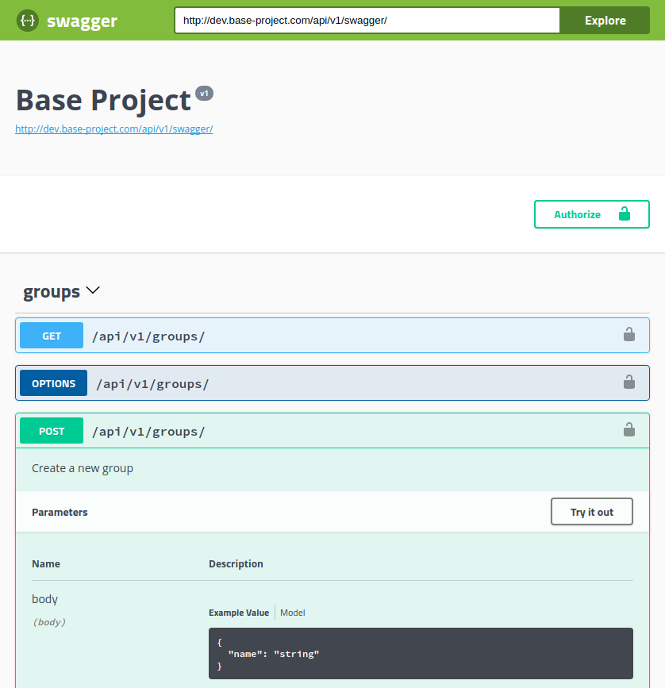

# Full stack, modern web applications using Python Flask, Docker, Swagger and more…

This article lives in:

* [Medium](https://medium.com/@tiangolo/full-stack-modern-web-applications-using-python-flask-docker-swagger-and-more-b6609dedb747)
* [GitHub](https://github.com/tiangolo/medium-posts/tree/master/full-stack-flask-docker)

## Intro

At Senseta we have many complex requirements for our systems, as part of that, in many cases, we need to create equally complex full-stack web applications.

We investigated and tried many approaches, but given the pace at which technology evolves, many of the available options seemed a bit "old".

In many cases, although we used some of those approaches for some projects, we knew there were better ways to do those same things…

## First steps

At some point, as part of my "free time experiments", I created the first version of an open source Docker image to deploy Flask applications.

I continued its development. We started using it internally at Senseta. Then it started to grow in features and popularity, it was helping other people too.

And right now it seems to be one of the (or just "the"?) most popular ways to deploy a Flask application in Docker. (It's here: [https://github.com/tiangolo/uwsgi-nginx-flask-docker](https://github.com/tiangolo/uwsgi-nginx-flask-docker) ).

But there were still several parts missing. Flask is just a micro-framework, you need a lot more than that.

## "Frameworks"

Building a Flask application gives a greater flexibility than many alternatives. As being a micro-framework, all the additional components are chosen and added separately.

But it also means that you have to navigate by yourself through all the options, plug-ins, and packages. And find which ones are the best for your problem.

In some cases, you might think you should choose one plug-in based on its popularity, without realizing that its development was discontinued a long time ago, or that there's a much better way to solve the problem you have, using a different plug-in or a different approach.

Some people say that that's the disadvantage of a micro-framework, it doesn't include anything and you have to decide which plug-ins and components to add, and you have the risk of choosing the wrong ones. A bigger framework already made those decisions for you.

Here's what I've found: a bigger framework indeed made a lot of decisions for you, but not necessarily the best ones. They might have been the best ones at some point, but not necessarily forever. And a bigger framework has to stick to those decisions. You know, backward compatibility and stuff…

## Ideal requirements

Project after project, we were realizing that we had some complex and specific requirements. And sadly, many of the available tools and approaches don't solve those problems. Or at least not all of them.

Even worse, some of the approaches have several features dedicated to solving other problems, that might be better solved by other tools or by different methods. But you end up having to deal with a lot of that. For example, a lot of boilerplate code to try to"isolate" some applications from others in code. While you could achieve the same more easily and in a less error-prone way with Docker containers.

Here are some of the ideal requirements we had:

* We do a lot of Machine Learning and Data Science, so Python was the best match for us.
* We wanted to keep using Docker, we have been using it for almost everything and we really like it. It solves a lot of problems in a very elegant way.
* We didn't want to be closely tied to any specific database. Relational databases solve many cases and are the "default" data store, but we wanted to be able to easily switch to a very different data store, like a NoSQL system.
* We wanted to be able to run asynchronous jobs with Celery easily and to be able to have several "modules" with different dependencies in different containers (possibly in different servers). I.e. we don't want to have to install all the packages of very different components everywhere (e.g. TensorFlow, CUDA, Tika, ScikitLearn, ElasticSearch-py, Flask, SQLAlchemy, etc).
* We wanted to be able to serve the backend as a web API.
* The frontend should be a modern framework, independent of the backend (Angular, React, Vue.js, etc).
* We wanted to be able to have the backend and frontend in the same domain, separated by URL path. For example, the backend takes all the URLs that go under /api/. And the frontend takes all the other URLs.
* The backend and frontend should be served by their own container under the hood.
* The frontend application should be built inside Docker, we didn't want to have to commit compiled code or need all the tooling installed on the deployment servers. But it shouldn't have to be a very big and fat container ([I already wrote a full post about that](https://medium.com/@tiangolo/angular-in-docker-with-nginx-supporting-environments-built-with-multi-stage-docker-builds-bb9f1724e984)).
* The backend should be testable independent of which database is being used, or even without a database. And we wanted to test the API itself, with all the API interactions.
* API tests should be easy to write, with just `requests` and `pytest` using simple `assert` statements. It should be at least, almost enjoyable.
* Deployment should be simple and straightforward, including continuous integration and continuous deployment.
* We wanted to have automatic Let's encrypt HTTPS certificate generation and handling, without having to modify the code.
* All the stack should be deployable in a distributed Docker system.
* We should be able to deploy more than one stack / domain to the same cluster of servers (or even the same server).
* The authentication should use modern JWT-token based authentication.
* We wanted the API to be self-documented and interactive.
* The components (backend, frontend, etc) should have good performance.
* Database migrations, should be integrated (although it only applies to the cases with relational databases like PostgreSQL or MySQL).
* Passwords and security had to follow best practices by default.
* It should be very easily extendable and modifiable. So you want to add ElasticSearch? Remove PostgreSQL and add Cassandra? Just modify the very specific parts and it should work.
* Development should be easy and very enjoyable.
* Deployment shouldn't be locked to any provider, you should be able to use any Linux cloud server you want. Or even your own physical server.
* You should be able to have a version (the most simple version) of a new project up and running with all the requirements, including deployment in a brand new server, in minutes. Or maybe seconds (how fast can you type about 10 commands?).
* And the list goes on and on…

## A recipe with open source ingredients

After a lot of investigation, a lot of research and a lot of projects that evolved the techniques of the previous projects, we developed our own structure and methods to create a full stack web application.

All using open source components, but making sure we use the “right” components. And it ended up being the closest to our ideal web application system… in our very subjective opinion.

Here are some of the features (and I'm probably missing some more):

* Full Docker integration (Docker based)
* Docker Swarm Mode deployment
* Docker Compose integration and optimization for local development
* Production ready Python web server using Nginx and uWSGI
* Python Flask backend with:
* Flask-apispec: Swagger live documentation generation
* Marshmallow: model and data serialization (convert model objects to JSON)
* Webargs: parse, validate and document inputs to the endpoint / route
* Secure password hashing by default
* JWT token authentication
* SQLAlchemy models (independent of Flask extensions, so they can be used with Celery workers directly)
* Basic starting models for users and groups (modify and remove as you need)
* Alembic migrations
* CORS (Cross Origin Resource Sharing)
* Celery worker that can import and use models and code from the rest of the backend selectively (you don’t have to install the complete app in each worker)
* REST backend tests based on Pytest, integrated with Docker, so you can test the full API interaction, independent on the database. As it runs in Docker, it can build a new data store from scratch each time (so you can use ElasticSearch, MongoDB, CouchDB, or whatever you want, and just test that the API works)
* Easy Python integration with Jupyter Kernels for remote or in-Docker development with extensions like Atom Hydrogen or Visual Studio Code Jupyter
* Angular frontend with:
* Docker server based on Nginx
* Docker multi-stage building, so you don’t need to save or commit compiled code
* Docker building integrated tests with Chrome Headless
* PGAdmin for PostgreSQL database, you can modify it to use PHPMyAdmin and MySQL easily
* Swagger-UI for live interactive documentation
* Flower for Celery jobs monitoring
* Load balancing between frontend and backend with Traefik, so you can have both under the same domain, separated by path, but served by different containers
* Traefik integration, including Let’s Encrypt HTTPS certificates automatic generation
* GitLab CI (continuous integration), including frontend and backend testing

## Open Source!

We have been very happy with our current methods and techniques, and as we are all big open source fans, we wanted to contribute what we found to be one of the best approaches to full stack development (in our very subjective opinion) back to the community.

So, we (silently) released it as open source about a month ago.

This is the way we are gluing together all the different components to fit our needs.

But as it has happened several times before, you might have some of the same needs too, so it might be useful for you.

It's a project generation system (using Cookiecutter) that takes your parameters (project name, domains to use, etc) and generates a full base project that you can continue evolving as you see fit, but that already includes many of the features of a modern full stack project:

### [https://github.com/tiangolo/full-stack](https://github.com/tiangolo/full-stack)

Note: the repository previously lived at [https://github.com/senseta-os/senseta-base-project](https://github.com/senseta-os/senseta-base-project), but as I'm the only maintainer, I continued its development in the new repo.

## Decisions, decisions…

There were many experiments, investigation, and tests for each of the decisions made. Each component, each plugin, and each decision was compared with all the alternatives, and there were some specific reasons for all of them.

I plan to write some additional posts covering those decisions and some specifics on how to develop a back end using all these techniques. So, please let me know in the comments what are you interested in, what should I cover in a new post, which decisions or techniques would you like to see explained or any question or comment you have.

I hope you find this useful. Let me know if it is.
