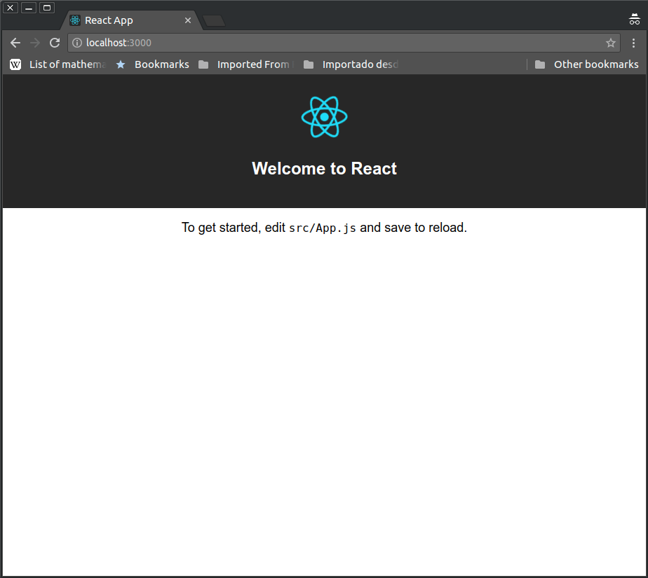

# React in Docker with Nginx, built with multi-stage Docker builds, including testing

Note: There's an equivalent article for Angular in [Medium](https://medium.com/@tiangolo/angular-in-docker-with-nginx-supporting-environments-built-with-multi-stage-docker-builds-bb9f1724e984) and [GitHub](https://github.com/tiangolo/medium-posts/tree/master/angular-in-docker).

Here's how to deploy a [React](https://reactjs.org/) app with [Docker](https://www.docker.com/), building it with [Node.js](https://nodejs.org) as you would do locally, but end up with a thin and efficient [Nginx](https://nginx.org/) image, with just the compiled code. Ready for production.

To achieve that, you can use [Docker "multi-stage builds"](https://docs.docker.com/engine/userguide/eng-image/multistage-build/). That will allow you to first build your React app inside a (possibly huge) Node JS Docker container that is later discarded in favor of a thin Nginx image with just your compiled app. And your final image will be as thin as the latest layer (Nginx).

All this removes the need for complex building scripts or the need to add your built app to git (your `dist` directory).

Also, optionally, you can run your Jest tests during the Docker image build. All the information is in the last section.

This could also be adapted to any compiled frontend framework. Check the links above for other versions of this article.

## TL;DR:

* Create a new React project, e.g. "my-react-app":

```bash
npx create-react-app my-react-app
```

* Enter into your project directory:

```bash
cd my-react-app
```

* While developing, use `npm start` as you normally would, to be able to use live-reload and other features. But for production deployment with Docker, and to test the production building process locally, do the following.
* Add a `.dockerignore` for `node_modules` with:

```
node_modules
```

* Add a `Dockerfile` to your directory with:

```Dockerfile
# Stage 0, "build-stage", based on Node.js, to build and compile the frontend
FROM tiangolo/node-frontend:10 as build-stage

WORKDIR /app

COPY package*.json /app/

RUN npm install

COPY ./ /app/

RUN npm run build


# Stage 1, based on Nginx, to have only the compiled app, ready for production with Nginx
FROM nginx:1.15

COPY --from=build-stage /app/build/ /usr/share/nginx/html

# Copy the default nginx.conf provided by tiangolo/node-frontend
COPY --from=build-stage /nginx.conf /etc/nginx/conf.d/default.conf
```

* Build your image and tag it with a name:

```bash
docker build -t my-react-app .
```

* Test your image with:

```bash
docker run -p 80:80 my-react-app
```

* Open your browser in <http://localhost>.

* If you are using testing and want to integrate it, read the last section.

## Details

*Everything above shows the actual code you need. If you're in a hurry, you could probably just copy all that. If you want to know all the details, continue reading...*

---

When you build a React front-end app, you most commonly write it in modern JavaScript (ECMAScript 2015) and then compile it to older, backward compatible, versions of JavaScript, to make sure it runs on all the browsers that you want to support. But you need to have Node.js and several packages to do that.

After you compile your app, you end up with a set of files, normally in a `./build` directory. Those are the compiled files that you actually use to serve your app. And those files have all the optimizations that you use, like minification of files.

And those files are the final product that you serve to your users. Your users don't need your source ES 6 (ECMAScript 2015) files nor any of the packages you use during development, just the compiled files.

So, you need to "deploy to production" only those files.

These are the options we have, take them as the "motivation" for what we will do next:

### Option 1:

One way to do it is to compile the app locally and add the compiled files to your Git repository. And then, when you are deploying, you just clone your repository and use those compiled files. As we are talking about Docker, you would create an image that copies and uses those compiled files. You would probably use an [Nginx base image](https://hub.docker.com/_/nginx/) for that.

But you never edit those compiled files directly, they are generated from your source files. They are constantly changing, so your Git repository will grow large just because you are adding compiled code. And if someone in your team works on a feature branch and has one version of those files and he wants to merge the feature to your main branch (probably `master`), you might have lots conflicts in those files, even when the source code doesn't have conflicts. So you would have to be fixing "virtual" conflicts. There are probably other disadvantages too. So, the compiled files don't really belong in your Git repository.

Also, if you forget to compile and commit everything right before deploying, you'll get an old version of the deployed app.


### Option 2:

Another way to do it would be to do not add your compiled code to your Git repository and build your app every time you are going to deploy.

But this would require all your deployment servers or wherever it is that you build your Docker image to have all the tooling to deploy your app. Node.js, all the packages and dependencies, etc.

And again, if you forget to compile everything right before deploying, you'll get an old version of the app deployed.

But all the problems that you would have with dependencies by needing to have all the tooling in a server is what Docker is supposed to solve, right?


### Option 3:

You could build the whole app inside your Docker image, and then serve it from the same image.

That would imply that you would start from an [official Node.js base image](https://hub.docker.com/_/node/) to compile everything and then you would have to setup a server with Node.js or install Nginx manually on top of Node.js (or something similar).

If you install Nginx by hand you lose the option to use the [official Nginx base image](https://hub.docker.com/_/nginx/) that is already fine tuned.

Also, you would end up with huge images that all your deployment servers have to download (if you are concerned about size) and a complex environment, with all the Node.js / React packages and dependencies.


### Option 4:

You could write a complex script that builds your app in one Docker image using Node.js, then extract the compiled files, and then build a second image based on Nginx with just your compiled files.

We are getting close, but you would have another complex script to debug. Copying files from a Docker container and to another Docker image, etc. Not that promising...


### Option 5:

Use [Docker multi-stage builds](https://docs.docker.com/engine/userguide/eng-image/multistage-build/). With that, you can have a Node.js base image that installs, builds and compiles everything, and then, "discard" all those Node.js specific Docker image layers, and end up with a Nginx image with just your compiled code.

You would have an efficient Nginx server with great performance for your static final (compiled) files. You wouldn't have to add your compiled code to Git, you always get the latest compiled version of your code, you don't have to deal with dependencies outside Docker, etc.

That's what I'm talking about! ...that's what we are gonna do now.

# Requirements

* A recent version of [Node.js](https://nodejs.org)
* [Docker](https://www.docker.com/)

## React

If you don't know React yet, go and do their [tutorial](https://reactjs.org/tutorial/tutorial.html) first.

If you are building a React frontend web app, you probably generate all your start code with a tool like [`npx create-react-app`](https://reactjs.org/docs/create-a-new-react-app.html#create-react-app). One of these tools let you focus on the code and handle all the "scaffolding" for you. This is probably a good idea, at least at the beginning. This is what we are gonna use here.

In recent versions of `npm` (that comes pre-installed with Node.js), you don't have to install global packages before being able to use them. You can use the command `npx` for that.

* Create a new React project, e.g. "my-react-app":

```bash
npx create-react-app my-react-app
```

* Enter into your project directory:

```bash
cd my-react-app
```

* Run the local, live-reload, server with:

```bash
npm start
```

...that will open your browser at http://localhost:3000/ and show your current app. As you change and save your files, it will auto-reload.

It will look something like:



While you are developing, the recommended way of serving your application locally is like that, with `npm start`. We will use Docker and Nginx later for production, but for develpment, that is the best option.

This is a bare-bones React project. Just the basic parts to show the point. There are many ways to improve React, adding React router, Redux or Mobx, GraphQL clients, etc. But we'll just stick to the basics we need to understand the point for now.

## Nginx

Nowadays, Nginx is more or less the "de facto standard" for static content serving. You can search about it and read about its performance. The web is full of articles about it.

So, for our final Docker image, we will need to have a Nginx configuration. You don't really need to know much more about it for now. As the official Docker image will do all the heavy lifting for you. And you don't have to worry about the configuration file as the Docker image we are gonna use already includes one for React. In the next section you will see how to copy it.

## Docker

If you don't know Docker yet, and you do at least some back-end stuff (deploying a front-end app counts), it might change your developer life. So, go ahead, [install Docker](https://docs.docker.com/engine/installation/) and follow the [Get Started guide](https://docs.docker.com/get-started/).

Now, let's assume you already know enough Docker to use it. Let's go to our details.

Here, we'll see how we can use Docker multi-stage builds. That way, the source code will be compiled inside a Node.js Docker container and the compiled code will then be copied to a thin Nginx Docker image that will have our final app, ready for production. But first we need to do a couple steps.

When you build your image, Docker normally "sends" all the files in the directory to the component of Docker that builds the image. If you have a `node_modules` directory, it will take some time sending that as `node_modules` directories tend to be huge and with lots of files. But you don't need `node_modules` to be copied to your Docker image, you will install everything inside and create a `node_modules` inside your container, so, sending all your `node_modules` is a waste of time.

The same way that you would add `node_modules` to your `.gitignore` file, you can use a `.dockerignore` file to tell Docker that it shouldn't "send" that directory.

* Add a `.dockerignore` for `node_modules` with:

```
node_modules
```

Now, let's build our Docker image.

* Add a file specifically named `Dockerfile` in your directory, with:

```Dockerfile
# Stage 0, "build-stage", based on Node.js, to build and compile the frontend
FROM tiangolo/node-frontend:10 as build-stage

WORKDIR /app

COPY package*.json /app/

RUN npm install

COPY ./ /app/

RUN npm run build


# Stage 1, based on Nginx, to have only the compiled app, ready for production with Nginx
FROM nginx:1.15

COPY --from=build-stage /app/build/ /usr/share/nginx/html

# Copy the default nginx.conf provided by tiangolo/node-frontend
COPY --from=build-stage /nginx.conf /etc/nginx/conf.d/default.conf
```

...now, let's check what all that is doing.

* This will tell Docker that we will start with a base image [tiangolo/node-frontend](https://hub.docker.com/r/tiangolo/node-frontend/) which in turn is based on the [Node.js official image](https://hub.docker.com/_/node/), notice that you won't have to install and configure Node.js inside the Linux container or anything, Docker does that for you:

```Dockerfile
FROM tiangolo/node-frontend:10 as build-stage
```

...we also "named" this stage `build-stage`, with the `as build-stage`. We will use this name later.

This image includes all the dependencies to install Puppeteer/Chrome Headless. In case you want to add full browser tests instead of `jsdom`. It also includes a default Nginx configuration. If you wanted, you could also base your image directly in Node and create and copy the Nginx configuration directly.

* Our working directory will be `/app`. This Docker "instruction" will create that directory and go inside of it, all the next steps will "be" in that directory:

```Dockerfile
WORKDIR /app
```

* Now, this instruction copies all the files that start with `package` and end with `.json` from your source to inside the container. With the `package*.json` it will include the `package.json` file and also the `package-lock.json` if you have one, but it won't fail if you don't have it. Just that file (or those 2 files), before the rest of the source code, because we want to install everything the first time, but not every time we change our source code. The next time we change our code and build the image, Docker will use the cached "layers" with everything installed (because the `package.json` hasn't changed) and will only compile our source code:

```Dockerfile
COPY package*.json /app/
```

* Install all the dependencies, this will be cached until we change the `package.json` file (changing our dependencies). So it won't take very long installing everything every time we iterate in our source code and try to test (or deploy) the production Docker image, just the first time and when we update the dependencies (installed packages):

```Dockerfile
RUN npm install
```

* Now, after installing all the dependencies, we can copy our source code. This section will not be cached that much, because we'll be changing our source code constantly, but we already took advantage of Docker caching for all the package install steps in the commands above. So, let's copy our source code:

```Dockerfile
COPY ./ /app/
```

* Then build the React app with:

```Dockerfile
RUN npm run build
```

...that will build our app, to the directory `./build/`. Inside the container will be in `/app/build/`.

* In the same `Dockerfile` file, we start another section (another "stage"), like if 2 `Dockerfile`s were concatenated. That's Docker multi-stage building. It almost just looks like concatenating `Dockerfile`s. So, let's start with an [official Nginx base image](https://hub.docker.com/_/nginx/) for this "stage":

```Dockerfile
FROM nginx:1.15
```

...if you were very concerned about disk space (and you didn't have any other image that probably shares the same base layers), or if, for some reason, you are a fan of Alpine Linux, you could change that line and use an [Alpine version](https://hub.docker.com/_/nginx/).

* Here's the Docker multi-stage trick. This is a normal `COPY`, but it has a `--from=build-stage`. That `build-stage` refers to the name we specified above in the `as build-stage`. Here, although we are in a Nginx image, starting from scratch, we can copy files from a previous stage. So, we can copy the compiled fresh version of our app. That compiled version is based on the latest source code, and that latest compiled version only lives in the previous Docker "stage", for now. But we'll copy it to the Nginx directory, just as static files:

```Dockerfile
COPY --from=build-stage /app/build/ /usr/share/nginx/html
```

* Now, we'll override the `default.conf` file in Nginx with the custom `nginx.conf` provided in the image `tiangolo/node-frontend`. This configuration file directs everything to `index.html`, so that if you use a router like [React router](https://reacttraining.com/react-router/) it can take care of it's routes, even if your users type the URL directly in the browser:

```Dockerfile
COPY --from=build-stage /nginx.conf /etc/nginx/conf.d/default.conf
```

Note: if you don't use the image `tiangolo/node-frontend` but a `node` image you will have to create that Nginx configuration file by hand and copy it from your source code in this step.

...that's it for the `Dockerfile`! Doing that with scripts or any other method would be a lot more cumbersome.

## Build it

Now we can build our image, doing it will compile everything and create a Nginx image ready for serving our app.

* Build your image and tag it with a name:

```bash
docker build -t my-react-app .
```

## Test it

To check that your new Docker image is working, you can start a container based on it and see the results.

* To test your image start a container based on it:

```bash
docker run -p 80:80 my-react-app
```

...you won't see any logs, just your terminal hanging there.

* Open your browser in <http://localhost>.

You should see something very similar to:


...notice that it is served by Docker and not by `npm start` (not in port `3000`).

* All the next builds will be very fast, as all the NPM packages will already be installed and Docker will re-use the cached layers. It will know it just has to copy your source code and compile it, etc. It won't install everything every time. But when you add a new dependency, your `package.json` will be modified, Docker will notice it and re-install the dependencies.


## Add testing

If you are using testing, for example with [Jest](https://jestjs.io/), as is the default with [`create-react-app`](https://github.com/facebook/create-react-app), you can run your tests during your Docker image building, adding the commands to your `Dockerfile`.

With that, your code will be tested during the build, and it will finish only when the tests pass. That way you can integrate it with CI systems (e.g. GitLab CI).

The application generated with `create-react-app` comes with Jest testing. You can run the tests locally before building the Docker image, with:

```bash
npm test
```

But we need it to run the tests only once, instead of keep waiting and watching for changes in the source code, which is the default. That way the Docker image can finish building, instead of "hanging" forever. To achieve that, we need to [set the `CI` environment variable to `true`](https://github.com/facebook/create-react-app/blob/master/CONTRIBUTING.md#heuristics).


So, in your `Dockerfile`, under the section like:

```Dockerfile
COPY ./ /app/
```

...add the testing command, with the `CI=true` environment variable:

```Dockerfile
RUN CI=true npm test
```

Your final `Dockerfile` could look like:

```Dockerfile
# Stage 0, "build-stage", based on Node.js, to build and compile the frontend
FROM tiangolo/node-frontend:10 as build-stage

WORKDIR /app

COPY package*.json /app/

RUN npm install

COPY ./ /app/

RUN CI=true npm test

RUN npm run build


# Stage 1, based on Nginx, to have only the compiled app, ready for production with Nginx
FROM nginx:1.15

COPY --from=build-stage /app/build/ /usr/share/nginx/html

# Copy the default nginx.conf provided by tiangolo/node-frontend
COPY --from=build-stage /nginx.conf /etc/nginx/conf.d/default.conf
```

* To test that your new Docker image with tests works, just build it again, you should see the results of the tests in the console during the building:

```bash
docker build -t my-react-app .
```

## Done!

That's it! React in Docker, ready for production with great performance (thanks to Nginx). A lot less error prone (thanks to Docker multi-stage builds). And with integrated tests that run in Docker at build time.

You can also automatize that in a continuous integration/delivery environment or whatever you want very easily with those tricks (I always do that).

There's a demo project with all what I described here in GitHub. If you have any problem replicating this, clone the repo and compare it to your code to see what could be happening.

Also, if you find something wrong in this article, please post an issue in that repo, or better, a pull request.

[GitHub version of the article](https://github.com/tiangolo/medium-posts/tree/master/react-in-docker)

[Medium version of the article](https://medium.com/@tiangolo/)

And let me know if this was helpful to you!
