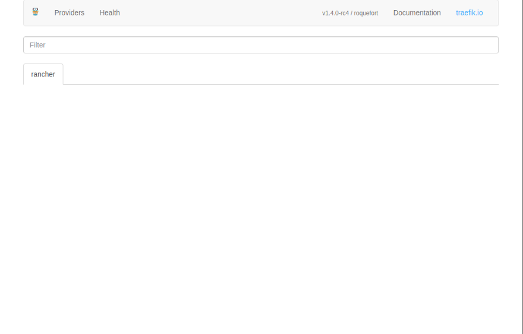
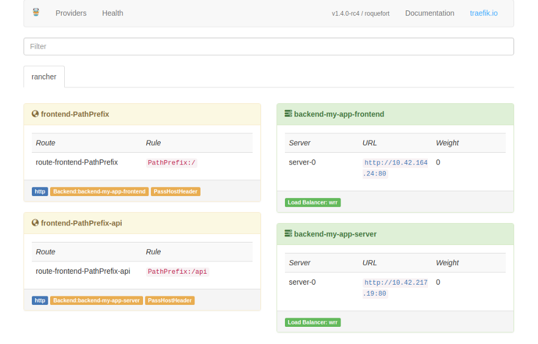

# Stack service load balancing with Traefik in Rancher (Docker)

<blockquote>
Set up Traefik to load balance / proxy your Docker services in a Rancher Stack, based on Traefik rules.
</blockquote>

## Update 2018-06-30

Since Rancher 2.0, it no longer is a cluster management system. 

It's mostly an interfafce to Kubernetes. So, if you are using an older version of Rancher, this might be useful. Otherwise, consider it obsolete. 

I'm currently writing an article on how to set up a Docker Swarm mode cluster with a Traefik main load balancer and also Traefik inside stacks (the same that this article talks about). With Docker Swarm mode it gets a lot easier, with automatic HTTPS certififcate generation for all the needed domains and a lot more robust. If you are interested in that, let me know. Also you can [follow me on Medium](https://medium.com/@tiangolo) to see when the article is published.

## Objective

I have a stack with several Docker services. The main services (related to this article) are:

* A back-end in Python Flask using [this image](https://github.com/tiangolo/uwsgi-nginx-flask-docker)
* A front-end in [Angular](https://angular.io/), in a [Nginx](https://nginx.org/) container, built using [this method](https://medium.com/@tiangolo/angular-in-docker-with-nginx-supporting-environments-built-with-multi-stage-docker-builds-bb9f1724e984)

I want to send everything that starts with a path `/api` to the API / back-end service. And everything that starts with a path `/` to the front-end service. But I want to keep both services under the same domain name, only separated by the path.

The stack is deployed with Rancher.

Here’s the current `docker-compose.yml` file:

```yaml
version: '2'
services:
  server:
    build: ./server
  frontend:
    build: ./frontend
```

## Idea

The idea is to add another service to the stack, a Traefik load balancer / proxy.

Then, I would redirect the public traffic to the Traefik proxy.

And the proxy would handle the rest, redirecting everything to the appropriate service, based on the path.

## TL;DR

In a hurry?

Here’s the final `docker-compose.yml` file:

```yml
version: '2'
services:
  proxy:
    image: traefik:v1.4
    command: --web --accessLog --constraints=tag==my-stack --rancher --rancher.exposedbydefault=false --rancher.metadata=true
    volumes:
      - /dev/null:/traefik.toml
  server:
    build: ./server
    labels:
      - "traefik.frontend.rule=PathPrefix:/api"
      - "traefik.enable=true"
      - "traefik.port=80"
      - "traefik.tags=my-stack"
  frontend:
    build: ./frontend
    labels:
      - "traefik.frontend.rule=PathPrefix:/"
      - "traefik.enable=true"
      - "traefik.port=80"
      - "traefik.tags=my-stack"
```

If you want to understand what’s happening, read on…

## Traefik

From [Traefik’s website](https://traefik.io/):

<blockquote>
Træfik (pronounced like traffic) is a modern HTTP reverse proxy and load balancer made to deploy microservices with ease.
</blockquote>

* You can configure it as a reverse proxy, to handle TLS (HTTPS) connections in front of your app, so your app doesn’t have to deal with that. This is known as “TLS termination”.
* You could use it to load balance traffic between back-end services, depending on domains, URL paths, etc.

That could be achieved with Nginx or HAProxy too. Those are quite common alternatives.

But, Traefik has some interesting advantages.

* It can automatize the generation of TLS certificates with Let’s encrypt.
* It can interact with several Docker systems to update its configuration.
* It updates its configuration live, you don’t have to restart it.
* You can set the configurations for each of your Docker services setting Docker labels in them. Traefik will catch that and update its configuration.

## Rancher

**Note**: please read the update above, versions of Rancher less than 2.0 are a completely different product, I think you can consider them obsolete.

From [Rancher’s website](https://rancher.com/):

<blockquote>
Rancher is a complete container management platform that makes managing and using containers in production really easy.
</blockquote>

With Rancher you can control a Docker cluster very easily. With a nice web interface. If you have people in your team that are not fans of the Terminal, Rancher might help.

## Problem

The tools seem the perfect match for the objective. But, configuring them to actually work is not that simple…

After 2 days trying to make it work and debugging, I decided to write this. I hope it helps others.

There are several references on the web related to this, but none is very clear about the full configuration.

[Traefik has support for Rancher as a backend](https://docs.traefik.io/configuration/backends/rancher/), but the documentation almost only shows example configuration files for Traefik, with almost no mention on how to configure the services.

[Rancher has an official article about integrating Traefik](https://rancher.com/traefik-active-load-balancer-on-rancher/), from 2016. But the article describes how to use a custom Traefik fork, not the official image.

[Rancher has another more recent article](https://rancher.com/setting-up-traefik-as-a-dynamically-configured-proxy-and-load-balancer/), from July 2017. But again, it describes how to use another custom Traefik fork.

I wanted to use the official image, I don’t want to depend on a fork created by a single user with some hacks to make it work. That fork could never receive updates again. Contrary to Traefik, that is very actively developed.

And Traefik supports Rancher. So I shouldn’t have to rely on custom hacks and forks.

The problem is that all the references, and many related issues in GitHub, describe very different methods, with many different requirements and setups.

I tried many of those settings unsuccessfully. Creating Rancher API keys, environment keys, creating Rancher labels, mounting the Docker `.sock` file, etc.

When I opened the Traefik exposed Web UI, almost always I got an empty Rancher tab:



## Solution

I needed to use a current version of Traefik (`1.4`) instead of the default (`latest`) as it includes [improvements and bug fixes for Rancher](https://github.com/containous/traefik/pull/2107).

But it wasn’t clear to me how I should configure Traefik and the other services, if I should mount the Docker `.sock` file, what configurations I had to add, if I had to mount a file or I could use command parameters, etc.

And I’m not completely sure what of the many incorrect and unnecessary configurations was preventing it from working correctly...

But once I got it working, I trimmed the configuration to the minimum.

It was a combination of some parameters passed to Traefik and some labels in the services.

Here’s the final working `docker-compose.yml` file:

```yaml
version: '2'
services:
  proxy:
    image: traefik:v1.4
    command: --web --accessLog --constraints=tag==my-stack --rancher --rancher.exposedbydefault=false --rancher.metadata=true
    volumes:
      - /dev/null:/traefik.toml
  server:
    build: ./server
    labels:
      - "traefik.frontend.rule=PathPrefix:/api"
      - "traefik.enable=true"
      - "traefik.port=80"
      - "traefik.tags=my-stack"
  frontend:
    build: ./frontend
    labels:
      - "traefik.frontend.rule=PathPrefix:/"
      - "traefik.enable=true"
      - "traefik.port=80"
      - "traefik.tags=my-stack"
```

* This parameter makes Traefik enable Rancher:

```
--rancher
```

* This parameter makes Traefik talk with the Rancher metadata, that way it can read the other services configurations:

```
--rancher.metadata=true
```

* This parameter makes Traefik expose the Web UI:

```
--web
```

* When I created more than one stack with services that had Traefik labels, the Traefik `proxy` service would catch all the labels in all the stacks and take them as rules. To make it filter only the services in my stack, I added a constraint to filter on a specific tag, it can be any string:

```
--constraints=tag==my-stack
```

* This Docker label (set in the `server` service) is what tells Traefik that it should send traffic with the prefix URL path `/api` to it:

```
- "traefik.frontend.rule=PathPrefix:/api"
```

* This Docker label (set in the `frontend` service) is what tells Traefik that it should send traffic with the prefix URL path `/` to it:

```
- "traefik.frontend.rule=PathPrefix:/"
```

* Somehow, Traefik needed Rancher services to declare their port, even if the image already exposes it. Without it, I always got an empty tab, that’s why both services have this label:

```
- "traefik.port=80"
```

* Adding the same tag that the Traefik service is using as constraint, I make the services in this stack pass the filter while all the services in other stacks don’t:

```
- "traefik.tags=my-stack"
```

* Make sure you don’t add a label with `traefik.backend=` as it will break how Traefik isolates Rancher stacks.
* Notice that there’s nothing else. No Rancher keys, no Rancher labels in the proxy, no Docker mounting, etc.

## Test

Then, you can open Traefik’s exposed web UI (exposed in port `8080` but you can map it to something different, as Rancher already uses that port) and it shows the services now mapped:



## Update

2018-06-30: Add deprecation notice. As Rancher 2.0 is a Kubernetes frontend.

2017–10–04: Include instructions to add constraints and tags. To allow different stacks have their own Traefik service even when running on the same host. [More details can be found here, in StackOverflow](https://stackoverflow.com/questions/46575893/is-it-possible-to-limit-traefik-to-the-current-docker-compose-stack/46576600).
